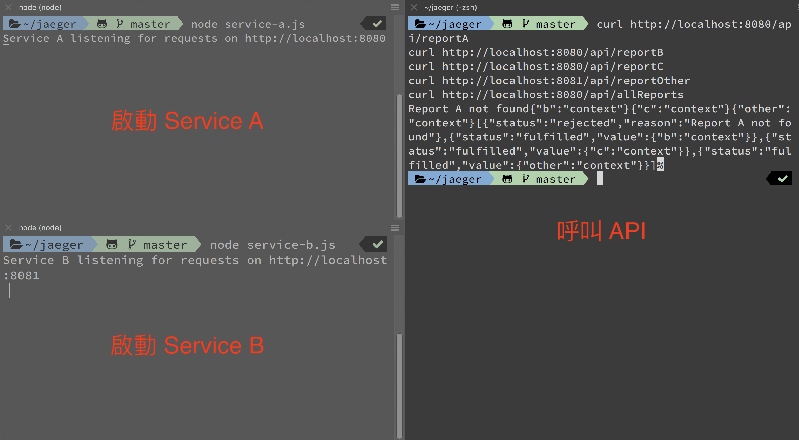

# 善用分布式追蹤系統，幫你找出程式的效能瓶頸與問題影響範圍（Jaeger with OpenTelemetry Node.js）

大型專案免不了要多個團隊合作，而每個團隊熟悉的程式語言可能不同，所部署的服務也可能分佈在多台 Server 上面。

在這樣複雜的架構下，如果系統的某個服務出問題，又或是遇到效能瓶頸；即便有 log 紀錄，但在上下依賴不清楚的狀態下，工程師需要花不少時間來釐清問題原因。

```
大綱
一、為什麼需要分布式追蹤系統？
二、如何使用分布式追蹤系統？
三、手把手帶你建立 Node.js 專案＆Jaeger 環境
四、啟動專案，並在 Jaeger UI 上查看自己發出的 Traces
```

### 一、為什麼需要分布式追蹤系統？

下面舉 2 個簡單的例子：

如果系統每個月會「定時產出月報」給客戶，但這個功能突然壞了，在排查問題時可能會經歷如下痛苦：
1. 是「排程」的部分沒執行，還是「產出月報」的功能有問題？
2. 產出月報的功能會呼叫「多個服務」，每個服務分別在不同的 Server 上。
3. 服務間有不同的執行順序與依賴關係，需要按照每個節點排查。

假使系統顯示 Dashboard（儀表板）的時間過長被客戶抱怨，工程師在優化時需要以下資訊才能判斷問題：
1. Dashboard 渲染時會呼叫很多 API，而耗時長的 API 背後通常有複雜的商業邏輯（ex：串連多個服務後才得到的結果）。
2. 即便知道哪個 API 是效能瓶頸，但因為串連的服務太多，需要逐一下 log 才能判斷出是哪個環節出了問題。

相信有不少人遇過這些困擾，所以今天筆者想要跟大家分享，如何用「Jaeger + OpenTelemetry + Node.js」搭建分布式追蹤系統，來幫我們：
1. 快速找出問題來源。
2. 判斷問題的影響範圍。
3. 透過圖像梳理服務的依賴關係，以及依賴的合理性。
4. 分析效能問題。

> **小提醒**：
> 每間公司的組織架構不同，第一時間接收錯誤訊息的未必是開發工程師，也可能是負責分析數據的團隊；如果系統的 log 訊息描述不清楚時，他們很難表達到底是哪裡出了問題，但如果使用分布式追蹤系統，他們就能很明確的指出問題，與工程師進行有效溝通。

### 二、如何使用分布式追蹤系統？

> 下一節會帶讀者在 local 環境建立一個微型專案，這邊先簡述使用情境。

我們的 Service A 提供下面 4 支 API：
- **GET /api/reportA**：A 報告故意拋出錯誤。
- **GET /api/reportB**：B 報告內部會呼叫多個服務。
- **GET /api/reportC**：C 報告跑很久，為效能瓶頸。
- **GET /api/allReports**：產出 A、B、C、Other 報告。
我們的 Service B 僅提供下面 1 支 API：
- **GET /api/reportOther**：Other 報告會呼叫另一台 Server 的 API。


如果執行「GET /api/allReports」這隻 API，它的運行架構是：
```
genAllReports(Service A)
    ├── reportA
    ├── reportB
    │       ├── reportB-1
    │       └── reportB-2
    ├── reportC
    └── reportOther(Service B)
```

因為在開頭有先說「GET /api/reportA」會拋出錯誤、「GET /api/reportC」是效能瓶頸；但如果在一無所知的狀態下直接呼叫「GET /api/allReports」這隻 API，那發生錯誤時，只能按照傳統的作法來慢慢排查 log。

初步了解專案架構後，下面我們先上幾張 Jaeger 的分析圖：


右上角的圖表中，紅色圓點是錯誤的標記，越大的圓點代表內含的 Span（邏輯運行單元）越多。

左邊則是搜尋條件：
- **Service**：要追蹤的服務。
- **Operations**：曾經觸發過的操作。
- **Tags**：我們可以為 Span 設計 Tag 方便過濾。
- **Lookback**：以時間過濾。
- **Min Duration/Min Duration**：用最小/最大執行時間作為過濾條件。
- **Limit Results**：筆數顯示。


如果執行過程中有錯誤，會有警示的 label；若使用到不同 Service 也會用不同顏色的 label 區分。。


我們可以點擊觀看執行的時間軸（Trace Timeline），上圖是「GET /api/allReports」這隻 API 的 Trace，我們可以很清楚每個 Span 之間的執行順序、依賴關係、執行時間、執行狀況。
- **Duration**：總運行時間耗費 2s。
- **Services**：關聯的服務為 2（service-a、service-b）。
- **Depth**：最深的 Span 有 6 層（hadle_report_other 那個）。
- **Total Spans**：總共有 11 個 Span。


也可以切換到圖形（Trace Graph）介面來觀察。

> 相信圖片比起文字更有說服力，在圖表與搜尋條件的輔助下，我們能更快找到問題點。

### 三、手把手帶你建立 Node.js 專案＆Jaeger 環境

這邊筆者就不細說程式邏輯，主要的目的是讓讀者在 local 端建立分布式追蹤系統，如果懶得按照步驟執行，可以直接到[筆者的 Github](https://github.com/dean9703111/jaeger-demo) Clone 一份下來。

> 筆者 local 的 Node.js 版本為 v18.12.0

**SETP 1**：建立專案、安裝必要套件。
```
npm init -f

npm install --save @opentelemetry/api
npm install --save @opentelemetry/resources
npm install --save @opentelemetry/semantic-conventions
npm install --save @opentelemetry/sdk-trace-node
npm install --save @opentelemetry/sdk-trace-base
npm install --save @opentelemetry/exporter-jaeger
npm install --save @opentelemetry/instrumentation-http
npm install --save axios
npm install --save express
```

**SETP 2**：新增「docker-compose.yml」貼上如下程式。
```yml
version: '2.0'

services:
  jaeger:
    container_name: practice-jaeger
    image: jaegertracing/all-in-one:1.38 # 當時用 1.39 或 latest 有出現一些 bug，故選用此版本
    environment:
      - COLLECTOR_ZIPKIN_HOST_PORT=:9411
    ports:
      - "5775:5775/udp"
      - "6831:6831/udp"
      - "6832:6832/udp"
      - "5778:5778"
      - "16686:16686"
      - "14250:14250"
      - "14268:14268"
      - "14269:14269"
      - "9411:9411"
```

**SETP 3**：輸入以下指令把 jaeger 的 Docker 拉下來並執行。
```
docker-compose up -d
```

**SETP 4**：新增「tracing.js」貼上如下程式，如果你想要對「opentelemetry」有更深入的了解，可以參考[官網](https://opentelemetry.io/docs/instrumentation/js/getting-started/nodejs/)；筆者範例主要是增加「exporter-jaeger、instrumentation-http」這兩個設定。

```js
'use strict';

const opentelemetry = require('@opentelemetry/api');
const { registerInstrumentations } = require('@opentelemetry/instrumentation');
const { NodeTracerProvider } = require('@opentelemetry/sdk-trace-node');
const { Resource } = require('@opentelemetry/resources');
const { SemanticResourceAttributes } = require('@opentelemetry/semantic-conventions');
const { BatchSpanProcessor } = require('@opentelemetry/sdk-trace-base');
const { JaegerExporter } = require('@opentelemetry/exporter-jaeger');
const { HttpInstrumentation } = require('@opentelemetry/instrumentation-http');

module.exports = (serviceName) => {
    const provider = new NodeTracerProvider({
        resource: new Resource({
            [SemanticResourceAttributes.SERVICE_NAME]: serviceName,
        }),
    });

    let exporter;
    exporter = new JaegerExporter({ endpoint: "http://127.0.0.1:14268/api/traces" });

    provider.addSpanProcessor(new BatchSpanProcessor(exporter));

    // Initialize the OpenTelemetry APIs to use the NodeTracerProvider bindings
    provider.register();

    registerInstrumentations({
        // // when boostraping with lerna for testing purposes
        instrumentations: [
            new HttpInstrumentation(),
        ],
    });

    return opentelemetry.trace.getTracer('my-service-tracer');
};
```

**SETP 5**：新增「service-a.js」貼上如下程式，我們在這裡建立 Service A 的 4 支 API。
```js
const api = require('@opentelemetry/api');
const tracer = require('./tracing')('service-a');
const express = require("express");
const PORT = "8080";
const app = express();
const axios = require('axios')
const waitFor = delay => new Promise(resolve => setTimeout(resolve, delay));

async function reportA() {
  let span = tracer.startSpan('report_a')
  await waitFor(500);
  span.setAttribute('report', 'A')
  span.recordException(new Error('Report A not found'))
  span.setStatus({ code: api.SpanStatusCode.ERROR, message: "Something wrong!" })
  span.addEvent('log', {
    'log.severity': 'error',
    'log.message': 'Report A not found',
    'endReport.id': '123',
  })
  span.end()
  throw "Report A not found";
}
async function reportB() {
  return await tracer.startActiveSpan('report_b', async (span) => {
    await waitFor(100);

    let child1 = tracer.startSpan('report_b_1')
    child1.end()
    let child2 = tracer.startSpan('report_b_2')
    child2.end()

    span.setAttribute('report', 'B')
    span.end()
    return { "b": "context" }
  })
}
async function reportC() {
  let span = tracer.startSpan('report_c')
  await waitFor(2000);
  span.setAttribute('report', 'C')
  span.end()
  return { "c": "context" }
}
async function reportOther() {
  try {
    let span = tracer.startSpan('report_other_request');
    let result;
    await api.context.with(api.trace.setSpan(api.context.active(), span),async () => {
      const { data } = await axios.get(`http://localhost:8081/api/reportOther`);
      result = data;
    });
    span.end()
    return result
  } catch (e) {
    throw e
  }
}
app.get("/api/allReports", async (req, res) => {
  tracer.startActiveSpan('gen_all_reports', async (span) => {
    const promises = [
      reportA(),
      reportB(),
      reportC(),
      reportOther()
    ];
    let result = await Promise.allSettled(promises);
    span.end()
    res.send(result);
  })
});
app.get("/api/reportA", async (req, res) => {
  try {
    let result = await reportA()
    res.send(result);
  } catch (e) {
    res.send(e);
  }
});
app.get("/api/reportB", async (req, res) => {
  try {
    let result = await reportB()
    res.send(result);
  } catch (e) {
    res.send(e);
  }
});
app.get("/api/reportC", async (req, res) => {
  try {
    let result = await reportC()
    res.send(result);
  } catch (e) {
    res.send(e);
  }
});

app.listen(parseInt(PORT, 10), () => {
  console.log(`Service A listening for requests on http://localhost:${PORT}`);
});
```
**SETP 6**：新增「service-b.js」貼上如下程式，我們在這裡建立的 API 是要給 Service A 呼叫的。
```js
const tracer = require('./tracing')('service-b');
const express = require("express");
const PORT = "8081";
const app = express();

app.get("/api/reportOther", (req, res) => {
  try {
    let span = tracer.startSpan('handle_report_other');
    span.end()
    res.send({ "other": "context" });
  } catch (e) {
    res.send(e);
  }
});

app.listen(parseInt(PORT, 10), () => {
  console.log(`Service B listening for requests on http://localhost:${PORT}`);
});
```

### 四、啟動專案，並在 Jaeger UI 上查看自己發出的 Traces

> 建議使用有分頁功能的終端機（如 iTerm2），這樣比較好觀察與操作。

在專案根目錄下輸入 `node service-a.js` 啟動 Service A 服務，並在另一個分頁輸入 `node service-b.js` 啟動 Service B 服務。

然後在終端機第三個分頁複製貼上以下指令，呼叫 API。
```
curl http://localhost:8080/api/reportA
curl http://localhost:8080/api/reportB
curl http://localhost:8080/api/reportC
curl http://localhost:8081/api/reportOther
curl http://localhost:8080/api/allReports
```



如果都按照步驟執行，在瀏覽器的網址輸入「 http://localhost:16686/search 」就可以開始追蹤你所設定的 Traces 嚕！


> **一些小建議**
> 1. 雖然分布式追蹤系統能幫我們許多忙，但如果所有的服務都靠它追蹤，那產生的 Record 數量會非常龐大，所以建議「追蹤重要的服務」為主。
> 2. 這邊為了方便 Demo，筆者使用 http 來做 instrumentation 的舉例，但實務上 grpc 的使用率可能更高。

筆者也是剛學習分布式追蹤系統的新人，如果描述有誤，或是有其他建議，再麻煩大神們不吝賜教，感謝～

參考文件：[一文讀懂 分佈式鏈路追蹤系統 Jaeger](https://www.readfog.com/a/1640986544679522304)